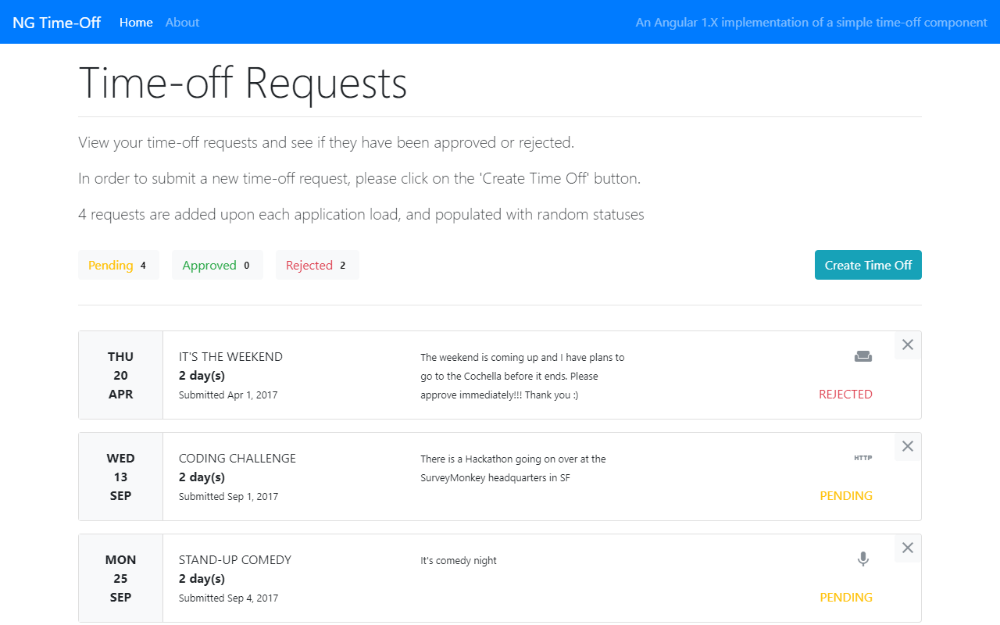
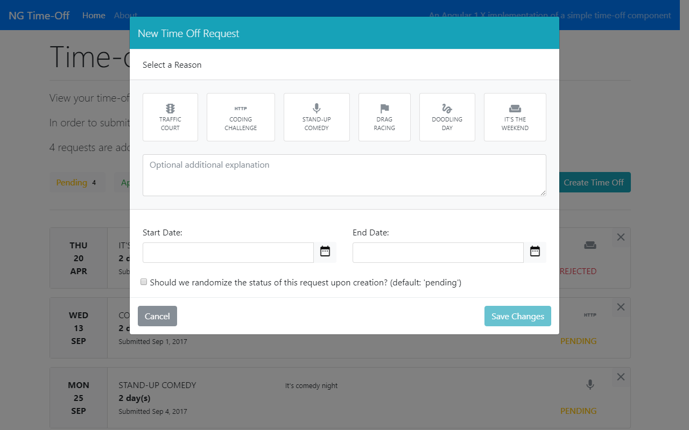

# Angular 1.X - Time-off Component
An Angular 1.X implementation of a simple time-off component.

#### Preview of the ng-timeoff application



#### Preview of the ng-timeoff application - 'Create Time Off'



##### The Application Structure

````
src/
  common/       <<< common app modules, components, directives, etc. (reusable code)
  modules/      <<< app modules and pages group topically
  index.js      <<< entry point
  index.html    <<< main html file
````

#### Installation (clone this repo)
````
git clone https://github.com/zainxyz/ng-timeoff.git
````

#### Run server for development

The local server runs on `http://localhost:3000`, and it comes with the Webpack's AutoRefresh feature using the `--inline` flag on the webpack-dev-server. [Read more about Webpack AutoRefresh.][77226b13].

  [77226b13]: https://webpack.github.io/docs/webpack-dev-server.html#automatic-refresh "Webpack Dev Server - Automatic Refresh"

````
npm i
npm start
````

#### Bundle it up for production

````
npm run build
````

#### Lint via eslint

````
npm run lint
````
